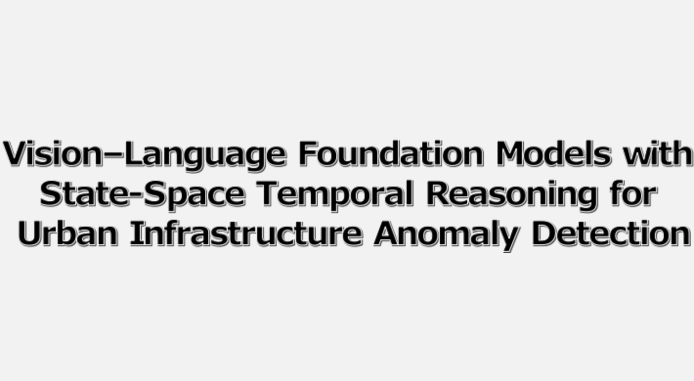

# AnomalyMamba

The source codes of "**Vision–Language Foundation Models with State-Space Temporal Reasoning for Urban Infrastructure Anomaly Detection**".

To cite this work:

```
@article{WANG2026104230,
title = {Vision–Language Foundation Models with State-Space Temporal Reasoning for Urban Infrastructure Anomaly Detection},
journal = {},
volume = {70},
pages = {104230},
year = {2026},
issn = {1474-0346},
doi = {},
url = {},
author = {Xiaowen Tao and Qingyuan Li},
keywords = {}
}
```

# Supplements

- Video that shows the AnomalyMamba performance on Handling the same exceptional scenario is more efficient.

  **Click to view the video:**

  <a href="https://youtu.be/Byf7BgjJIq0" target="_blank">
  
  </a>

# Architecture

  
