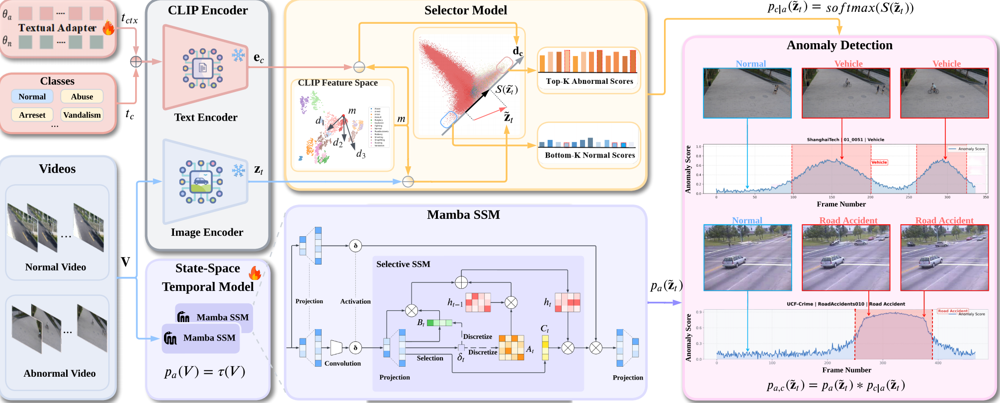

# AnomalyMamba

The source codes of "**Vision–Language Foundation Models with State-Space Temporal Reasoning for Urban Infrastructure Anomaly Detection**".

To cite this work:

```
@article{WANG2026104230,
title = {LocoMamba: Vision-driven locomotion via end-to-end deep reinforcement learning with Mamba},
journal = {Advanced Engineering Informatics},
volume = {70},
pages = {104230},
year = {2026},
issn = {1474-0346},
doi = {https://doi.org/10.1016/j.aei.2025.104230},
url = {https://www.sciencedirect.com/science/article/pii/S1474034625011231},
author = {Yinuo Wang and Xiaowen Tao},
keywords = {Quadrupedal robots, Vision-driven locomotion, Reinforcement learning, Cross-modal fusion, End-to-end policy learning},
abstract = {Applying deep reinforcement learning (DRL) to quadrupedal robots is promising for obstacle negotiation, terrain locomotion, and real-world deployment. Existing methods either train blind agents that sacrifice foresight or adopt cross-modal fusion architectures with limitations; even Transformer-based models still suffer from the quadratic cost of self-attention. To overcome these challenges, we propose LocoMamba, a vision-driven cross-modal DRL framework built on selective state–space models (Mamba). LocoMamba encodes proprioceptive and vision features into compact tokens, which are fused by stacked Mamba layers through near-linear-time selective scanning. This reduces latency and memory usage while preserving long-range dependencies. The policy is trained end-to-end with Proximal Policy Optimization under randomized terrain and obstacle-density curriculum, using a state-centric reward balancing task and safety. Evaluations in diverse static and dynamic obstacle settings show that LocoMamba significantly outperforms a Transformer baseline, achieving 48.9% higher returns, 30.4% longer distance, and 48.9% fewer collisions on trained terrains, while exhibiting stronger generalization to unseen scenarios. Moreover, it converges faster with limited compute, enhancing training efficiency. Overall, LocoMamba improves locomotion performance and reduces training cost, supporting rapid iteration and deployment of quadruped learning algorithms. A repository is hosted at https://github.com/allen-quad-robot/locomamba.}
}
```

# Supplements

- Video that shows the AnomalyMamba performance on Handling the same exceptional scenario is more efficient.

  **Click to view the video:**

  <a href="media/Performance.mov" target="_blank">
  
  </a>

# Architecture

  
